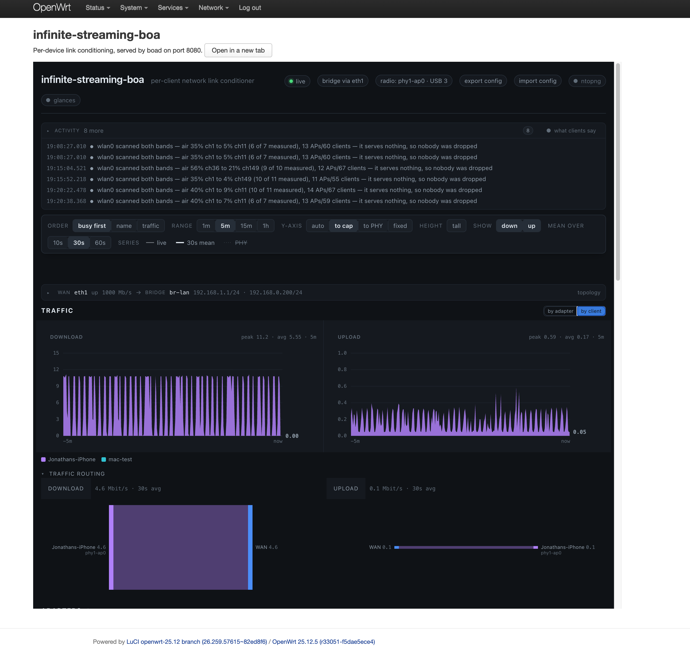

# boa on OpenWrt

Runs `boad` on an OpenWrt device as a procd service, next to LuCI, instead of
on the Raspberry Pi OS image. Measured on a Raspberry Pi 5 with OpenWrt 25.12.5
(`bcm27xx/bcm2712`) and two MT7961 (`mt7921u`) USB adapters.

Feeds are published for three architectures, and the install snippet below
picks the right one from the device's own `DISTRIB_ARCH`:

| Architecture | Devices |
|---|---|
| `aarch64_cortex-a76` | Raspberry Pi 5 |
| `aarch64_cortex-a53` | MT7981/MT7986 routers — Cudy TR3000, GL.iNet MT3000 |
| `x86_64` | a PC, or a virtual machine |

**x86 needs its drivers installing by hand**, which the other two do not: the
Pi's and the Cudy's radios and NICs are in their images, and the generic x86
image ships neither USB ethernet nor USB Wi-Fi drivers. A `mt7921u` adapter
needs `kmod-mt7921u`, an RTL8153 needs `kmod-usb-net-rtl8152`, and without them
the adapter is simply absent while `boa-setup check` still reports boa's
dependencies as installed. See #368.



This file is what any OpenWrt device needs.
[`CUDY-TR3000.md`](CUDY-TR3000.md) is the other kind of document: what ONE
specific box took, start to finish, with the LuCI path for every step and what
its AP-class radios do that the Pi's cannot -- announced channel switches,
transmit power that is honoured, scanning while serving.

## Prerequisite: a transparent bridge

boa shapes uplink on the egress of the port cabled to the existing network,
matching each client by its own address. Behind NAT every client leaves with the
router's address, so the device must bridge, not route:

- `br-lan` holds the uplink port (`eth1` here), any wired client ports, and the
  APs (`wifi-iface ... option network 'lan'`).
- `lan` uses `proto dhcp`; the upstream router is the only DHCP/RA server
  (`dhcp.lan.ignore=1`, `dhcpv4/dhcpv6/ra=disabled`).
- Delete the `wan`/`wan6` interfaces.

Keep a static rescue address on the bridge (a second interface on `br-lan`,
e.g. `192.168.1.1/24`) so the device stays reachable if the DHCP lease moves.

## Prerequisite: full wpad, with 802.11k/v on

OpenWrt's default `wpad-basic-mbedtls` has no BSS transition management, so
**steer** fails with `UNKNOWN COMMAND`, and without 802.11k on the AP a client
advertises no beacon-report capability, so **measure** is refused. Install the
full build and enable both on every AP:

```sh
apk del wpad-basic-mbedtls && apk add wpad-mbedtls hostapd-utils
/etc/init.d/wpad enable && /etc/init.d/wpad start   # the swap leaves it stopped
uci set wireless.default_radio1.ieee80211k=1
uci set wireless.default_radio1.bss_transition=1    # repeat per wifi-iface
uci commit wireless && wifi reload
```

**Start `wpad` before `wifi reload`.** Removing the basic package stops the
service and installing the full one does not start it; a reload with no
hostapd running leaves every AP down until it is started by hand.

## Check a device: `boa-setup check`

```sh
boa-setup check
```

Installed with the `boa` package. It walks every prerequisite above and below
-- access, USB adapters and their drivers, hostapd, each access point, the
transparent bridge, packages, boa's own config, the service -- and prints each
as `OK`, `WARN` or `FAIL`, with the command that fixes it. It exits 1 if
anything failed.

**It is read-only**: no `uci set`, no reload, no restart, so it is safe on a
router carrying traffic. Two of its findings come from the device rather than
from config. The uplink is the `br-lan` port the bridge learned the default
gateway's MAC on, so a `boa.main.wan` that names the wrong port is caught; and
a Wi-Fi netdev outside the bridge is offered as the scan radio.

Measured on the Pi 5: the prepared device passed with 0 failed and 0 warnings.
Run against a copy of its config edited back to a router's -- `lan` static,
`wan` present, DHCP and RA on, a radio on 6 GHz without a country, 802.11k off,
`boa.main.wan` on the wrong port, no scan radio -- it reported all nine, as
5 failures and 4 warnings, each with its fix.

## Install from the package feed

Signed releases are published to a feed on GitHub Pages,
<https://jonathaneoliver.github.io/infinite-streaming-boa/>, by
`.github/workflows/packages.yml` on every `v*` tag. With the prerequisites
above in place:

```sh
wget -O /etc/apk/keys/boa-packages.pem \
  https://jonathaneoliver.github.io/infinite-streaming-boa/openwrt/boa-packages.pem
. /etc/openwrt_release   # DISTRIB_ARCH picks the feed
echo https://jonathaneoliver.github.io/infinite-streaming-boa/openwrt/25.12/$DISTRIB_ARCH/packages.adb \
  >> /etc/apk/repositories.d/customfeeds.list
apk update && apk add luci-app-boa
```

Then `boa-setup check` says what the device still needs. Later releases arrive
with `apk upgrade`, or from LuCI -> System -> Software.
The workflow signs with the repository secret `BOA_APK_PRIVATE_KEY`, the same
key as a local build, and refuses to run without it -- a key made on a runner
would sign a feed no device trusts. It can also be run by hand from the
Actions tab.

## Build the packages yourself

```sh
./scripts/openwrt-package.sh                     # dist/openwrt/: boa, luci-app-boa, packages.adb
./scripts/openwrt-package.sh root@<device>       # and install them there
```

Two packages, as OpenWrt splits an application from its LuCI page:

- **boa** (`aarch64_cortex-a76` or `aarch64_cortex-a53`, from the SDK): `/usr/libexec/boa/boad`, `/etc/init.d/boa`,
  `/etc/config/boa` (a conffile: an edited copy survives an upgrade, and the
  packaged one lands beside it as `.apk-new`). Depends on `tc-full kmod-netem
  kmod-ifb kmod-sched-core kmod-nft-bridge ip-full ip-bridge iw iperf3`, so apk
  installs those too. `/etc/infinite-streaming-boa/` is kept across a
  sysupgrade. Installing enables and starts the service; removing it stops it,
  which takes every qdisc boa placed with it.
- **luci-app-boa** (`noarch`): Services -> infinite-streaming-boa, boa's interface in a frame.

The script cross-compiles boad on the host and packs both in the OpenWrt SDK
container (`openwrt/sdk:bcm27xx-bcm2712-25.12.5`, x86-64, emulated on arm64;
about 20 s). For a MediaTek Filogic router (Cudy TR3000, GL.iNet MT3000) name
its SDK instead: `SDK_IMAGE=openwrt/sdk:mediatek-filogic-25.12.5`. The package
architecture comes from the SDK, and the feed publishes both. `openwrt/package/*/Makefile` define the packages -- names,
dependencies, descriptions -- and still build them in a buildroot with the
feeds; `openwrt/mkpkg.sh` reads them and does what `include/package-pack.mk`
does, because the SDK's own `make` rebuilds every kmod package boa depends on.

**Signing.** As in OpenWrt, the packages are trusted through a signed index,
`packages.adb`. The key is made once in `cache/openwrt-keys/` (gitignored); the
install step puts its public half in `/etc/apk/keys/boa-packages.pem` and
installs from the index, so apk verifies it and needs no `--allow-untrusted`.

Measured on the Pi 5: installed over a hand-deployed copy, apk kept the edited
`/etc/config/boa` byte for byte and wrote the packaged one as `.apk-new`. It
did the same for `/etc/init.d/boa`, which is not a conffile but was not yet
owned by a package; move that `.apk-new` into place once.

## Install for development

```sh
./scripts/openwrt-deploy.sh root@<device>
```

Copies the binary, init script and LuCI files straight over, for a quick loop.
On a device with the packages installed this replaces package-owned files, so
`apk` will see them as modified until the next package install.

## Configuration

`/etc/config/boa`, then `service boa reload`:

| Option | Default | Meaning |
|---|---|---|
| `addr` | `:8080` | Listen address |
| `bridge` | `br-lan` | The bridge |
| `wan` | `eth1` | Uplink bridge port; uplink is shaped here |
| `wlan` | *(empty)* | AP interfaces; empty = every Wi-Fi port on the bridge |
| `lan` | *(empty)* | Wired client ports; empty = every other non-wan port |
| `scan` | *(empty)* | Listen-only radios |
| `state` | `/etc/infinite-streaming-boa/policies.json` | Policy store. `/var` is tmpfs here |
| `iperf` | `1` | Run `iperf3 -s` alongside |
| `tls_addr` | `:8443` | Also serve https here; empty = off |
| `tls_cert`, `tls_key` | `/etc/uhttpd.crt`, `/etc/uhttpd.key` | LuCI's own certificate (DER, from uhttpd) |

`wlan` and `lan` are read from the bridge at each start because OpenWrt names
APs after the phy (`phy1-ap0`) and USB radios can enumerate in another order.

**Set `scan` whenever a radio is spare.** With no listen-only radio, boa
learns which serving radio scans without dropping its AP and then scans that
one every 15 seconds -- whether or not clients are on it. On the Pi 5 that was
an `mt7921u` AP that a gather had just filled with every client. The onboard
`brcmfmac` (`wlan0`) is unused in this setup, so `option scan 'wlan0'` moves
every background scan onto a radio that serves nothing.

## Measured on the Pi 5 (2026-09-18)

A MacBook on 5 GHz (ch149, 80 MHz), one policy of down 20 Mbit/s + 50 ms and
up 10 Mbit/s:

| | Unconditioned | Conditioned |
|---|---|---|
| Ping to the upstream router | 5.5 ms | 58.2 ms |
| Download from the internet, 8 s | 47 Mbit/s | 12 Mbit/s |

`tc` showed `netem ... delay 50ms rate 20Mbit` under `phy1-ap0` and
`netem ... rate 10Mbit` under `eth1`, and nothing for the other two clients.
Disabling the policy returned the ping to 4.8 ms with no netem left installed.
Stopping the service removed every qdisc it had added.

## Who owns the radios

OpenWrt does: netifd creates the APs and starts hostapd from
`/etc/config/wireless` at boot, on `wifi reload` and on a LuCI save. boa acts
on the running hostapd through its control sockets and never reloads anything.
The two only agree because boa writes every channel move it keeps -- a move
channel, or a scan with `apply=1` -- into UCI as `band`, `channel` and the
width in `htmode`, committed without a reload (`uci.go`). Measured: phy2 moved
by boa from 2.4GHz ch 6 to 5GHz ch 36/80MHz stayed on 5GHz across a
`wifi reload`, and moving it back rewrote UCI to `2g`/`6`/`HE20`.

Both of these -- the UCI write-back and the ubus ban mirror below -- run only
when boad is started with `-openwrt`, which `/etc/init.d/boa` passes. Nothing
is detected: without the flag boad behaves exactly as on the Pi OS image, and
with it a missing `uci` or `ubus` is logged rather than skipped.

Anything else boa changes at runtime -- deny lists, AP off, thresholds,
profiles -- is not in UCI and is dropped by the next reload.

Every ban boa places with DENY_ACL is also placed on OpenWrt's own ban list
(`ubus call hostapd.<ap> del_client` with a `ban_time`), so `list_bans` and
tools that read it see what boa is doing (`ubusban.go`). The mirror lasts
15 s at most and never longer than boa's own hold, because ubus has no unban:
a 10 s deadzone showed in `list_bans` for 10 s, and a gather pinned for 30 s
showed its three bans for 15 s while the deny list held on. Do not run
`usteer` or `dawn` beside boa -- both steer clients through the same object.

## Link and radio controls, as measured

On the Pi 5 above, with `wpad-mbedtls` and 802.11k/v on. A MacBook was the
client for every per-device control.

| Control | Result |
|---|---|
| Drop (deauth), nudge (disassoc) | Works. Back on the same radio in 3-4 s |
| Deadzone | Works. Refused on its radio; the client moved to the other band |
| Steer (802.11v) | Works. `BSS-TM-RESP status_code=6`: the Mac declined and returned its own candidates |
| Measure (802.11k) | Works. `BEACON-REQ-TX-STATUS ack=1`, then `BEACON-RESP-RX` |
| Gather | Works. Moved the client from 2.4 GHz to 5 GHz |
| Scan | Works. Full 2.4 GHz survey with a recommendation |
| AP off/on, RTS threshold | Report success; the AP was serving afterwards |
| Profile | Reports success and rebuilds the BSS; whether the parameters applied is unverified (see `runningConfigFor` below) |
| Evict | Works. Moved the Mac off phy2 back to phy1 |
| Deauth-all | Reports success, but the radio was empty when tested |
| Gather/evict, other clients | An iPhone and a Watch left the SSID for another saved network rather than land on the target radio: a ban only covers this box's radios |
| Power | Fails: `no rfkill switch`. OpenWrt's kernel has no rfkill (`/dev/rfkill` is absent) |
| Channel (CSA) | Fails on `mt7921u`: hostapd returns `FAIL` to `CHAN_SWITCH`. The box falls back to the restart in the same request (#154, #349) |
| BSS load | Fails every tick: `bss_load_test` exists only in hostapd builds with testing options |

And on a Cudy TR3000 (`mediatek/filogic`, MT7981 radios, 2026-09-22), a MacBook,
an iPhone and a Watch on the 5 GHz AP, each radio-wide steer naming the USB
`mt7921u` AP on ch 149:

| Control | Result |
|---|---|
| Steer | All stayed. Mac `status_code=1`, iPhone `status_code=7` |
| Warn (Disassociation Imminent, no timer) | hostapd never disassociated anyone (a Mac held 16 s). Two of three left on their own, the Mac first to 2.4 GHz, not the AP named |
| Term (BSS Termination Included) | The AP stayed `ENABLED`. The one client left moved to 2.4 GHz, not the AP named |
| Any of the three | No deny-list entry on any radio |
| Transmit power | Works on the built-in `mt798x` radios, live: 23/10/3 dBm took a MacBook from −38/−48/−55 dBm received with its association unbroken and no ping lost. Written to UCI, so a `wifi reload` keeps it |
| Attenuation moves a real client, and the thresholds differ | An iPhone one room away, walked down and back up in 2 dB steps. It left 5 GHz for the 2.4 GHz AP at **11 dBm** (−57 dBm, 25.8 Mbit/s there) and returned at **19 dBm** (−72 dBm, 576 Mbit/s): **8 dB of hysteresis**, so leaving and returning are two measurements, not one. It kept streaming across both moves -- 13.2 Mbit/s downlink while on 2.4 GHz, about half that link's 25.8 Mbit/s PHY rate. No ban and no steer: every move was the phone's own. The AP-side signal on `phy1` stayed near −73 dBm throughout, because that is the uplink and a change in the AP's power does not touch it |
| Transmit power, USB `mt7921u` | Refused, and caught by measurement: with the known-bad list bypassed, a set to 10 dBm was accepted by `iw`, read back as 3.00 dBm, and the radio was marked as ignoring the control (#202) |
| Channel switch, built-in `mt798x` | **Announced, and the clients follow.** Six switches on `phy1` — 40@80 to 44@40, 44 to 36@80, 36/44/36 at 40, then back to 40@80 — each reported `method: announce` with `outage_sec: 0`, and the box's own before/after station comparison counted **1 of 1** followed four times and **3 of 3** on the last, a MacBook, an iPhone and a Watch riding it together |
| Channel switch forced to restart | `mode=restart` on the same radio: 1.0 s and 1.1 s out of service, the one client dropped without being told. A third took **84.7 s**, because the AP came back with no BSS and the daemon rebuilt it — so the outage a restart costs is not a constant |
| Channel switch, and what it does NOT teach | The forced restarts left `announces: true` on the driver: a refusal is learned only from an announcement that FAILED on an ordinary in-band move the fallback then completed. Forcing the slow path is a choice, not evidence |

## Not yet working on OpenWrt

- **Restarting a wedged AP.** `restartHostapd` finds hostapd through
  `systemctl`, which OpenWrt does not have, so it logs that no unit serves the
  interface and gives up. The control-socket path (DISABLE/ENABLE) is unaffected
  and is the one normally used. OpenWrt's equivalent is `wifi up <radio>`.
- **Radio profile restore.** `runningConfigFor` reads the config file from
  hostapd's command line. OpenWrt starts hostapd with only a global socket and
  keeps each phy's config in `/var/run/hostapd-phyN.conf`, so the lookup finds
  nothing.
- **ntopng and glances** are not packaged for OpenWrt; boa reports both as not
  running.
- **No deploy guard.** Unlike `scripts/deploy.sh`, this script does not check
  for a running sweep or pattern before restarting the daemon.
