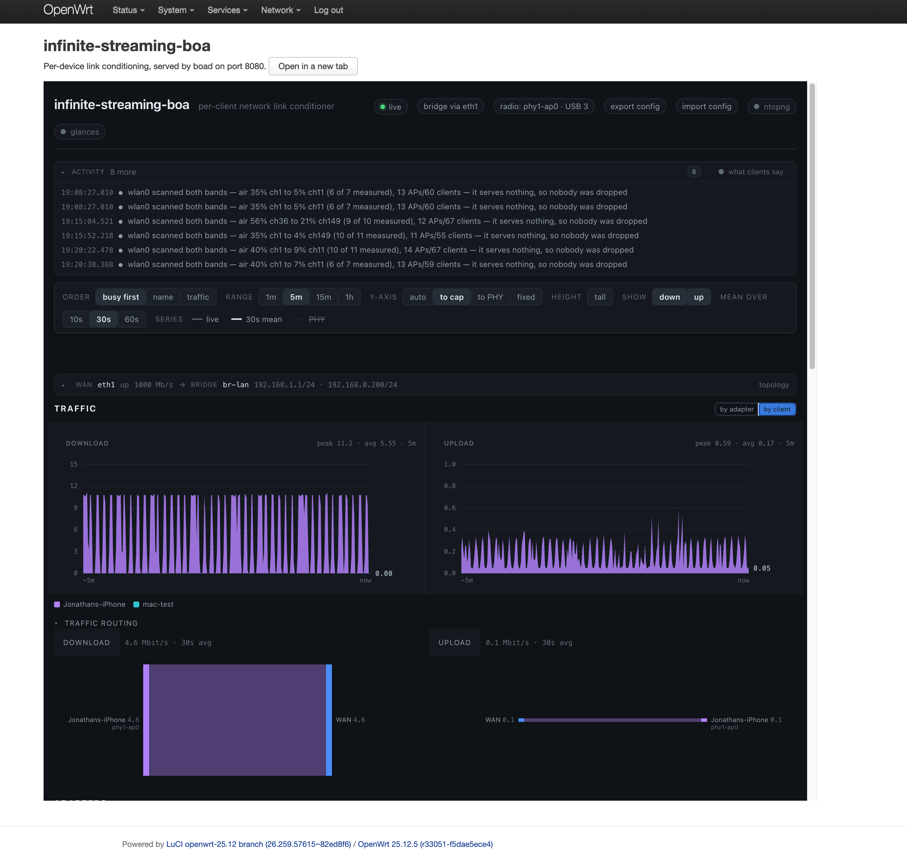

# boa on OpenWrt

Runs `boad` on an OpenWrt device as a procd service, next to LuCI, instead of
on the Raspberry Pi OS image. Measured on a Raspberry Pi 5 with OpenWrt 25.12.5
(`bcm27xx/bcm2712`) and two MT7961 (`mt7921u`) USB adapters.

Feeds are published for three architectures, and the install snippet below
picks the right one from the device's own `DISTRIB_ARCH`:

| Architecture | Devices |
|---|---|
| `aarch64_cortex-a76` | Raspberry Pi 5 |
| `aarch64_cortex-a53` | MT7981/MT7986 routers — Cudy TR3000, GL.iNet MT3000 |
| `x86_64` | a PC, or a virtual machine |

**x86 needs its drivers installing by hand**, which the other two do not: the
Pi's and the Cudy's radios and NICs are in their images, and the generic x86
image ships neither USB ethernet nor USB Wi-Fi drivers. A `mt7921u` adapter
needs `kmod-mt7921u`, an RTL8153 needs `kmod-usb-net-rtl8152`, and without them
the adapter is simply absent while `boa-setup check` still reports boa's
dependencies as installed. See #368. The setup page installs them, and
[`boa-setup install-drivers`](#boa-setup-install-drivers) does it on a box that
is already set up.



This file is what any OpenWrt device needs.
[`CUDY-TR3000.md`](CUDY-TR3000.md) is the other kind of document: what ONE
specific box took, start to finish, with the LuCI path for every step and what
its AP-class radios do that the Pi's cannot -- announced channel switches,
transmit power that is honoured, scanning while serving.

## Prerequisite: a transparent bridge

boa shapes uplink on the egress of the port cabled to the existing network,
matching each client by its own address. Behind NAT every client leaves with the
router's address, so the device must bridge, not route:

- `br-lan` holds the uplink port (`eth1` here), any wired client ports, and the
  APs (`wifi-iface ... option network 'lan'`).
- `lan` uses `proto dhcp`; the upstream router is the only DHCP/RA server
  (`dhcp.lan.ignore=1`, `dhcpv4/dhcpv6/ra=disabled`).
- Delete the `wan`/`wan6` interfaces.

Keep a static rescue address on the bridge (a second interface on `br-lan`,
e.g. `192.168.1.1/24`) so the device stays reachable if the DHCP lease moves.

## Prerequisite: full wpad, with 802.11k/v on

OpenWrt's default `wpad-basic-mbedtls` has no BSS transition management, so
**steer** fails with `UNKNOWN COMMAND`, and without 802.11k on the AP a client
advertises no beacon-report capability, so **measure** is refused.

```sh
boa-setup install-wpad          # add --dry-run to see the commands first
uci set wireless.default_radio1.ieee80211k=1
uci set wireless.default_radio1.bss_transition=1    # repeat per wifi-iface
uci commit wireless && wifi reload
```

`install-wpad` removes the basic package, installs the full build and starts
`wpad` again, in that order. **The order is the point.** Removing the basic
package stops the service and installing the full one does not start it, so a
`wifi reload` that lands in between leaves every AP down until `wpad` is
started by hand — measured on the Cudy on 2026-09-24, where exactly that left
`phy1-ap0` down while the other two came back.

It **cannot** be a package dependency, which is the obvious alternative. The
two wpad variants declare a mutual `conflicts` — each provides `hostapd` and
`wpa-supplicant` — so `apk add wpad-mbedtls` fails outright while the basic one
is installed, at matching revisions and more so on a stock image, where
`hostapd-common` is pinned a revision behind and `kmod-mac80211` depends on it.
Removing the basic package first is what frees both. So `DEPENDS:=+wpad-mbedtls`
would not give boa the full hostapd; it would make boa uninstallable.

Because the swap stops every AP on the box, `install-wpad` **refuses while any
access point is running** and says so, unless given `--force`. On a stock image
there is nothing to refuse over: both `wifi-iface`s ship `option disabled '1'`,
so a fresh device is serving nothing.

## Check a device: `boa-setup check`

```sh
boa-setup check
```

Installed with the `boa` package. It walks every prerequisite above and below
-- access, adapters and their drivers on both the USB and PCI buses, hostapd,
each access point, the transparent bridge, packages, boa's own config, the
service -- and prints each
as `OK`, `WARN` or `FAIL`, with the command that fixes it. It exits 1 if
anything failed.

**It is read-only**: no `uci set`, no reload, no restart, so it is safe on a
router carrying traffic. Two of its findings come from the device rather than
from config. The uplink is the `br-lan` port the bridge learned the default
gateway's MAC on, so a `boa.main.wan` that names the wrong port is caught; and
a Wi-Fi netdev outside the bridge is offered as the scan radio.

Measured on the Pi 5: the prepared device passed with 0 failed and 0 warnings.
Run against a copy of its config edited back to a router's -- `lan` static,
`wan` present, DHCP and RA on, a radio on 6 GHz without a country, 802.11k off,
`boa.main.wan` on the wrong port, no scan radio -- it reported all nine, as
5 failures and 4 warnings, each with its fix.

## Set a device up from a browser: the first-run wizard

A device fresh from a flash is not yet a boa box: it has **no root password**,
and every `wifi-iface` ships `option disabled '1'`. It cannot be set up over the
air, because there is no access point to join.

So **the device's own address shows the setup page** until it has been set up,
and goes back to LuCI afterwards. The same page stays at **Services → boa
setup** for changing any of it later. `PRD.md` §6.8 is the behaviour this
implements.

> Captured on target 5 — the x86-64 OpenWrt guest with an MT7915E passed
> through — on 2026-09-28, from a vanilla image with the packages installed and
> nothing else done to it.


**Use a wired port.** Applying takes every radio down and back up, so a browser
on Wi-Fi would cut itself off part-way through. The page says so, and on a fresh
device there is no radio to be on anyway.

There is no login. A device with no root password is open to anyone who can
reach it — which is what the card says and what the last step fixes — so asking
an operator to type nothing into a password box, under an "Authorization
Required" heading, to reach the page that *sets* the password, would be a wrong
turn that reads like a fault. It stops working the moment a password exists.

### What it does before it asks anything


**Anything missing is installed, not printed.** Radio drivers, `wpad` with the
authentication `steer` and `measure` need, and mDNS. A command for an operator
to retype is a step that can be skipped, mistyped, or run against the wrong
device.

A module is loaded before its firmware is unpacked and the probe is never
retried, so a radio stays invisible until the device restarts. That is normal
and happens once — and it is why this step exists at all rather than the wizard
simply finding no radios.


**Setup survives the reboot.** The page waits, comes back, and returns to the
step it left rather than to the beginning.

### The four questions


The SSID is **suggested** from the board name and the last two octets of the LAN
MAC — a MAC is in every beacon, so a name built from one reveals nothing.

The country is optional but asked rather than guessed: it unlocks DFS channels,
2.4 GHz ch 12/13 and 3–6 dB of power, and a wrong country is a regulatory
answer.

The root password is the step that closes the open door the landing page warned
about, which is why it is part of setup rather than something to remember
afterwards.

**The bridge is ticked by default**, because becoming a transparent bridge is
what makes the device a boa box rather than an access point. Untick it to do it
later with `boa-setup convert`.

### Applying, and where the device went


Two things in that log are worth knowing about. A radio on **6 GHz is moved to
5 GHz**, because the drivers here will not run an access point on it. And
channels are **planned across the radios that serve**, so two 5 GHz radios do
not end up sharing one.


**It ends by naming where the device now is.** Applying changes the address — a
bridged box takes a lease from the upstream network — so the last thing setup
does is say so, and offer the new address rather than leaving an operator to
find a box that has moved. The old address stays on the bridge as a rescue
address.

The countdown is a convenience, not a trap: **Stay here** cancels it, and
**Change these settings** goes back to the questions.

## Set a device up without touching it: `boa-firstrun.conf`

A box that nobody sets up waits **two minutes from boot** for somebody to open
the setup page, then brings itself up. What it decides alone is deliberately
limited -- an SSID derived from the board name and the LAN MAC, a passphrase
generated per device, and no country -- because the two things that matter most
cannot be guessed:

- a **root password** a box invented would lock the operator out, since there is
  no screen to read it from and no label to print it on;
- **`convert`** changes the device's address, and unattended it can strand the
  box somewhere nobody can reach.

A file changes what those are. `root_password=` written by the owner is an
instruction, not a guess, so the unattended path can carry it out and the device
comes up **fully** configured:

```sh
# /boot/boa-firstrun.conf   (x86, Pi: mountable from another machine before
#                            the device has ever been switched on)
# /etc/boa-firstrun.conf    (anywhere else: baked into the image, or copied
#                            over before first boot)
ssid=bench-3
key=a passphrase, 8-63 characters
country=GB
root_password=...
convert=no
```

Every key is optional and anything absent falls back to what the box would have
chosen, so a file naming only an SSID still gets a generated passphrase. The
file is **deleted once read** -- it carries a password in clear -- and what it
did is recorded in `/etc/infinite-streaming-boa/firstrun`, root-readable only,
including whether the root password was actually set.

`/etc/boa-firstrun.conf.example` ships with the `boa` package and documents
every key. Opening the setup page cancels the countdown, so an operator who
arrives in time is never raced.

### Watching the countdown: `boa-setup firstrun`

```sh
boa-setup firstrun status    # what first run did, or "armed: nothing has run yet"
boa-setup firstrun cancel    # stop the countdown, as opening the setup page does
boa-setup firstrun now       # bring the box up unattended now, without waiting
```

`status` prints the record kept in `/etc/infinite-streaming-boa/firstrun`,
**including the generated passphrase**. It is the one place to read that
passphrase, which is deliberately not shown on the setup page: after `convert`,
that page can be reached from the whole upstream network.

`now` refuses on a box that has already been set up. It would give the box a
new SSID and passphrase and drop every client on it, and running it a second
time once replaced a file-driven setup with a random one. `firstrun --force`
does it anyway.

## The other `boa-setup` commands

The setup page runs each of these for you. They exist separately for a box
that is already set up and has changed: a new adapter, a new radio, a lost
mDNS name. Each one takes `--dry-run` to print what it would do and change
nothing. The two installers say "nothing to do" when there is nothing to do, so
running them again is safe; `plan-channels` is not quite, see below.

### `boa-setup install-drivers`

```sh
boa-setup install-drivers --dry-run
boa-setup install-drivers
```

Installs the kmod packages for adapters that have no driver, on both the USB
and the PCI bus. It installs only for adapters boa recognises. An unknown
adapter is listed under "No package known for" to be reported, not guessed at.

**A radio may need a reboot after this.** apk can install a module before its
firmware, and the kernel loads the module as soon as it lands, fails to find
the firmware, and never retries. Measured on the x86-64 guest with an
MT7915E. `install-drivers` checks afterwards rather than assuming, names any
adapter that is still without a driver, and exits 1. A reboot fixes it, and so
does reloading the module.

This is the command for the x86 image, which ships no USB Wi-Fi or USB
ethernet drivers (see the top of this file).

### `boa-setup install-mdns`

```sh
boa-setup install-mdns
```

Installs and starts `umdns`, so the box answers to `<hostname>.local`. The
name matters most when the address is least predictable: `convert` moves the
LAN to DHCP, so the lease is the upstream router's choice, while the name
follows the box to whatever address it gets. The setup page sets the hostname
from the SSID.

If the install fails, the box still works, but it will not answer to a
`.local` name. The command says so rather than failing quietly. Re-run it once
the uplink is working.

### `boa-setup plan-channels`

```sh
boa-setup plan-channels --dry-run
boa-setup plan-channels
```

Gives each radio that serves an access point a channel that does not clash
with the others. Without a plan, OpenWrt configures each radio on its own, and
two 5 GHz radios can land on the same channel. Each then halves the other's
airtime while both are reported healthy.

| Band | In order of preference |
|---|---|
| 5 GHz | 36 and 149 at 80 MHz, the only two non-DFS 80 MHz blocks |
| 2.4 GHz | 6, 1, 11 |

- **A third 5 GHz radio moves to 2.4 GHz**, not to the other 5 GHz blocks.
  Those are all DFS: a radio there must listen for radar before it may beacon,
  and leave the channel if it hears some, so it can disappear without notice.
- **A reservation covers everything the radio occupies.** A radio on 36 at
  80 MHz holds 36 to 48, so nothing else is placed on 40.
- **Width is set together with the channel.** A radio's channel and width
  (`htmode`) are never left disagreeing.
- **Every channel is checked against the radio.** Channels its phy marks
  disabled or no-IR are skipped, so 149 is never written in a regulatory domain
  that lacks it.
- **A radio already on a legal, unclaimed channel keeps it.** Only the rest are
  placed, so running this after plugging in a new radio does not move one that
  is carrying clients.
- **The listening radio is placed separately**, from the back of the plan,
  so it does not sit on the channel the next serving radio would be given.

**It reloads Wi-Fi every time it runs, even when no channel changed**, so every
client on the box briefly reconnects. Use `--dry-run` first on a box carrying
traffic. The setup page runs it after the radios are up, and so does the
hotplug hook when a radio is plugged into a running box.

## Install from the package feed

Signed releases are published to a feed on GitHub Pages,
<https://jonathaneoliver.github.io/infinite-streaming-boa/>, by
`.github/workflows/packages.yml` on every `v*` tag. With the prerequisites
above in place:

```sh
wget -O /etc/apk/keys/boa-packages.pem \
  https://jonathaneoliver.github.io/infinite-streaming-boa/openwrt/boa-packages.pem
. /etc/openwrt_release   # DISTRIB_ARCH picks the feed
echo https://jonathaneoliver.github.io/infinite-streaming-boa/openwrt/25.12/$DISTRIB_ARCH/packages.adb \
  >> /etc/apk/repositories.d/customfeeds.list
apk update && apk add luci-app-boa
```

`scripts/openwrt-boa-feed.sh root@<device>` does exactly that over SSH, reading
`DISTRIB_ARCH` from the device rather than guessing it and adding the feed line
once rather than once per run.

**This is the step LuCI cannot do.** System -> Software can add a repository and
install a package, but it has no interface for `/etc/apk/keys/` and no
`--allow-untrusted`, so `apk` rejects the signed index and the page just fails.
Until boa is in the official feed (#359), installing it needs a shell exactly
once, for the key.

### On a Raspberry Pi, give it a WAN first

**OpenWrt's board profile gives a Pi no WAN at all.** `02_network` matches
`raspberrypi,*` and sets `lan` on `eth0`, then flushes -- so the generic
`wan=eth1` fallback in `99-default_network` hits its `json_is_a network object`
guard and never runs. `/etc/board.json` on a Pi 5 carries a `lan` key and
nothing else. USB ethernet adapters are ignored even though their driver
(`kmod-usb-net-rtl8152`) is in the image.

So a Pi fresh from a flash can reach no feed, and every install of boa needs
one -- `tc-full`, `kmod-netem`, `kmod-ifb`, `kmod-sched-core` and the rest come
from `downloads.openwrt.org`. A Cudy and an x86 guest both get a `wan` from
their profiles, which is why this bites only here.

Cable it so the roles match what OpenWrt already decided:

- your computer -> the Pi's **built-in** ethernet socket (that is the LAN, and
  where the setup page is served)
- your router -> **any** USB ethernet adapter

Then, in LuCI at `http://192.168.1.1/` -> Network -> Interfaces -> Add, or:

```sh
uci set network.wan=interface
uci set network.wan.device='eth1'   # the adapter facing your router
uci set network.wan.proto='dhcp'
uci commit network && /etc/init.d/network reload
```

`openwrt-boa-feed.sh` and `openwrt-boa-install.sh` do this for you when the
device has no `wan` and cannot reach a feed, choosing the USB adapter that has
a live cable -- never by interface number, which follows USB enumeration order
and moves when an adapter is replugged. Pass `--no-configure-wan` to stop them.
`boa-setup convert` deletes the `wan` again when it bridges the box, so this is
scaffolding rather than the finished shape.

Then `boa-setup check` says what the device still needs. Later releases arrive
with `apk upgrade`, or from LuCI -> System -> Software.
The workflow signs with the repository secret `BOA_APK_PRIVATE_KEY`, the same
key as a local build, and refuses to run without it -- a key made on a runner
would sign a feed no device trusts. It can also be run by hand from the
Actions tab.

## Build the packages yourself

```sh
./scripts/openwrt-boa-build.sh                     # dist/openwrt/: boa, luci-app-boa, packages.adb
./scripts/openwrt-boa-install.sh root@<device>     # install what was built, no rebuild
```

Two packages, as OpenWrt splits an application from its LuCI page:

- **boa** (`aarch64_cortex-a76` or `aarch64_cortex-a53`, from the SDK): `/usr/libexec/boa/boad`, `/etc/init.d/boa`,
  `/etc/config/boa` (a conffile: an edited copy survives an upgrade, and the
  packaged one lands beside it as `.apk-new`). Depends on `tc-full kmod-netem
  kmod-ifb kmod-sched-core kmod-nft-bridge ip-full ip-bridge iw iperf3`, so apk
  installs those too. `/etc/infinite-streaming-boa/` is kept across a
  sysupgrade. Installing enables and starts the service; removing it stops it,
  which takes every qdisc boa placed with it.
- **luci-app-boa** (`noarch`): Services -> infinite-streaming-boa, boa's interface in a frame.

The script cross-compiles boad on the host and packs both in the OpenWrt SDK
container (`openwrt/sdk:bcm27xx-bcm2712-25.12.5`, x86-64, emulated on arm64;
about 20 s). For a MediaTek Filogic router (Cudy TR3000, GL.iNet MT3000) name
its SDK instead: `SDK_IMAGE=openwrt/sdk:mediatek-filogic-25.12.5`. The package
architecture comes from the SDK, and the feed publishes both. `openwrt/package/*/Makefile` define the packages -- names,
dependencies, descriptions -- and still build them in a buildroot with the
feeds; `openwrt/mkpkg.sh` reads them and does what `include/package-pack.mk`
does, because the SDK's own `make` rebuilds every kmod package boa depends on.

**Signing.** As in OpenWrt, the packages are trusted through a signed index,
`packages.adb`. The key is made once in `cache/openwrt-keys/` (gitignored); the
install step puts its public half in `/etc/apk/keys/boa-packages.pem` and
installs from the index, so apk verifies it and needs no `--allow-untrusted`.

Measured on the Pi 5: installed over a hand-deployed copy, apk kept the edited
`/etc/config/boa` byte for byte and wrote the packaged one as `.apk-new`. It
did the same for `/etc/init.d/boa`, which is not a conffile but was not yet
owned by a package; move that `.apk-new` into place once.

## Install for development

```sh
./scripts/openwrt-deploy.sh root@<device>
```

Copies the binary, init script and LuCI files straight over, for a quick loop.
On a device with the packages installed this replaces package-owned files, so
`apk` will see them as modified until the next package install.

## Configuration

`/etc/config/boa`, then `service boa reload`:

| Option | Default | Meaning |
|---|---|---|
| `addr` | `:8080` | Listen address |
| `bridge` | `br-lan` | The bridge |
| `wan` | `eth1` | Uplink bridge port; uplink is shaped here |
| `wlan` | *(empty)* | AP interfaces; empty = every Wi-Fi port on the bridge |
| `lan` | *(empty)* | Wired client ports; empty = every other non-wan port |
| `scan` | *(empty)* | Listen-only radios |
| `state` | `/etc/infinite-streaming-boa/policies.json` | Policy store. `/var` is tmpfs here |
| `iperf` | `1` | Run `iperf3 -s` alongside |
| `tls_addr` | `:8443` | Also serve https here; empty = off |
| `tls_cert`, `tls_key` | `/etc/uhttpd.crt`, `/etc/uhttpd.key` | LuCI's own certificate (DER, from uhttpd) |

`wlan` and `lan` are read from the bridge at each start because OpenWrt names
APs after the phy (`phy1-ap0`) and USB radios can enumerate in another order.

**Set `scan` whenever a radio is spare.** With no listen-only radio, boa
learns which serving radio scans without dropping its AP and then scans that
one every 15 seconds -- whether or not clients are on it. On the Pi 5 that was
an `mt7921u` AP that a gather had just filled with every client. The onboard
`brcmfmac` (`wlan0`) is unused in this setup, so `option scan 'wlan0'` moves
every background scan onto a radio that serves nothing.

## Measured on the Pi 5 (2026-09-18)

A MacBook on 5 GHz (ch149, 80 MHz), one policy of down 20 Mbit/s + 50 ms and
up 10 Mbit/s:

| | Unconditioned | Conditioned |
|---|---|---|
| Ping to the upstream router | 5.5 ms | 58.2 ms |
| Download from the internet, 8 s | 47 Mbit/s | 12 Mbit/s |

`tc` showed `netem ... delay 50ms rate 20Mbit` under `phy1-ap0` and
`netem ... rate 10Mbit` under `eth1`, and nothing for the other two clients.
Disabling the policy returned the ping to 4.8 ms with no netem left installed.
Stopping the service removed every qdisc it had added.

## Who owns the radios

OpenWrt does: netifd creates the APs and starts hostapd from
`/etc/config/wireless` at boot, on `wifi reload` and on a LuCI save. boa acts
on the running hostapd through its control sockets and never reloads anything.
The two only agree because boa writes every channel move it keeps -- a move
channel, or a scan with `apply=1` -- into UCI as `band`, `channel` and the
width in `htmode`, committed without a reload (`uci.go`). Measured: phy2 moved
by boa from 2.4GHz ch 6 to 5GHz ch 36/80MHz stayed on 5GHz across a
`wifi reload`, and moving it back rewrote UCI to `2g`/`6`/`HE20`.

Both of these -- the UCI write-back and the ubus ban mirror below -- run only
when boad is started with `-openwrt`, which `/etc/init.d/boa` passes. Nothing
is detected: without the flag boad behaves exactly as on the Pi OS image, and
with it a missing `uci` or `ubus` is logged rather than skipped.

Anything else boa changes at runtime -- deny lists, AP off, thresholds,
profiles -- is not in UCI and is dropped by the next reload.

Every ban boa places with DENY_ACL is also placed on OpenWrt's own ban list
(`ubus call hostapd.<ap> del_client` with a `ban_time`), so `list_bans` and
tools that read it see what boa is doing (`ubusban.go`). The mirror lasts
15 s at most and never longer than boa's own hold, because ubus has no unban:
a 10 s deadzone showed in `list_bans` for 10 s, and a gather pinned for 30 s
showed its three bans for 15 s while the deny list held on. Do not run
`usteer` or `dawn` beside boa -- both steer clients through the same object.

## Link and radio controls, as measured

On the Pi 5 above, with `wpad-mbedtls` and 802.11k/v on. A MacBook was the
client for every per-device control.

| Control | Result |
|---|---|
| Drop (deauth), nudge (disassoc) | Works. Back on the same radio in 3-4 s |
| Deadzone | Works. Refused on its radio; the client moved to the other band |
| Steer (802.11v) | Works. `BSS-TM-RESP status_code=6`: the Mac declined and returned its own candidates |
| Measure (802.11k) | Works. `BEACON-REQ-TX-STATUS ack=1`, then `BEACON-RESP-RX` |
| Gather | Works. Moved the client from 2.4 GHz to 5 GHz |
| Scan | Works. Full 2.4 GHz survey with a recommendation |
| AP off/on, RTS threshold | Report success; the AP was serving afterwards |
| Profile | Reports success and rebuilds the BSS; whether the parameters applied is unverified (see `runningConfigFor` below) |
| Evict | Works. Moved the Mac off phy2 back to phy1 |
| Deauth-all | Reports success, but the radio was empty when tested |
| Gather/evict, other clients | An iPhone and a Watch left the SSID for another saved network rather than land on the target radio: a ban only covers this box's radios |
| Power | Fails: `no rfkill switch`. OpenWrt's kernel has no rfkill (`/dev/rfkill` is absent) |
| Channel (CSA) | Fails on `mt7921u`: hostapd returns `FAIL` to `CHAN_SWITCH`. The box falls back to the restart in the same request (#154, #349) |
| BSS load | Not available: hostapd answers `FAIL`, because `bss_load_test` exists only in hostapd builds with testing options. Before #444 boa retried it every 15 s and reported it applied |

And on a Cudy TR3000 (`mediatek/filogic`, MT7981 radios, 2026-09-22), a MacBook,
an iPhone and a Watch on the 5 GHz AP, each radio-wide steer naming the USB
`mt7921u` AP on ch 149:

| Control | Result |
|---|---|
| Steer | All stayed. Mac `status_code=1`, iPhone `status_code=7` |
| Warn (Disassociation Imminent, no timer) | hostapd never disassociated anyone (a Mac held 16 s). Two of three left on their own, the Mac first to 2.4 GHz, not the AP named |
| Term (BSS Termination Included) | The AP stayed `ENABLED`. The one client left moved to 2.4 GHz, not the AP named |
| Any of the three | No deny-list entry on any radio |
| Transmit power | Works on the built-in `mt798x` radios, live: 23/10/3 dBm took a MacBook from −38/−48/−55 dBm received with its association unbroken and no ping lost. Written to UCI, so a `wifi reload` keeps it |
| Attenuation moves a real client, and the thresholds differ | An iPhone one room away, walked down and back up in 2 dB steps. It left 5 GHz for the 2.4 GHz AP at **11 dBm** (−57 dBm, 25.8 Mbit/s there) and returned at **19 dBm** (−72 dBm, 576 Mbit/s): **8 dB of hysteresis**, so leaving and returning are two measurements, not one. It kept streaming across both moves -- 13.2 Mbit/s downlink while on 2.4 GHz, about half that link's 25.8 Mbit/s PHY rate. No ban and no steer: every move was the phone's own. The AP-side signal on `phy1` stayed near −73 dBm throughout, because that is the uplink and a change in the AP's power does not touch it |
| Transmit power, USB `mt7921u` | Refused, and caught by measurement: with the known-bad list bypassed, a set to 10 dBm was accepted by `iw`, read back as 3.00 dBm, and the radio was marked as ignoring the control (#202) |
| Channel switch, built-in `mt798x` | **Announced, and the clients follow.** Six switches on `phy1` — 40@80 to 44@40, 44 to 36@80, 36/44/36 at 40, then back to 40@80 — each reported `method: announce` with `outage_sec: 0`, and the box's own before/after station comparison counted **1 of 1** followed four times and **3 of 3** on the last, a MacBook, an iPhone and a Watch riding it together |
| Channel switch forced to restart | `mode=restart` on the same radio: 1.0 s and 1.1 s out of service, the one client dropped without being told. A third took **84.7 s**, because the AP came back with no BSS and the daemon rebuilt it — so the outage a restart costs is not a constant |
| Channel switch, and what it does NOT teach | The forced restarts left `announces: true` on the driver: a refusal is learned only from an announcement that FAILED on an ordinary in-band move the fallback then completed. Forcing the slow path is a choice, not evidence |

## Not yet working on OpenWrt

- **Advertised BSS Load: the "Advertised, not enforced" panel.** It
  corrects the utilisation a radio's beacon advertises, or claims more load to
  give a client a reason to roam, through hostapd's `bss_load_test`. That
  option exists only in hostapd builds with testing options, and OpenWrt's
  `wpad` is not one: hostapd answers `FAIL` and logs `unknown configuration
  item 'bss_load_test'` (measured on target 5, 2026-09-29,
  `wpad-mbedtls 2025.08.26`). boa asks once when it starts, warns once per
  radio, and the panel says why in place of its controls. The beacon keeps
  hostapd's own figure. The Pi and the container are unaffected: their hostapd
  has the option.
- **Restarting a wedged AP.** `restartHostapd` finds hostapd through
  `systemctl`, which OpenWrt does not have, so it logs that no unit serves the
  interface and gives up. The control-socket path (DISABLE/ENABLE) is unaffected
  and is the one normally used. OpenWrt's equivalent is `wifi up <radio>`.
- **Radio profile restore.** `runningConfigFor` reads the config file from
  hostapd's command line. OpenWrt starts hostapd with only a global socket and
  keeps each phy's config in `/var/run/hostapd-phyN.conf`, so the lookup finds
  nothing.
- **ntopng and glances** are not packaged for OpenWrt; boa reports both as not
  running.
- **No deploy guard.** Unlike `scripts/deploy.sh`, this script does not check
  for a running sweep or pattern before restarting the daemon.
